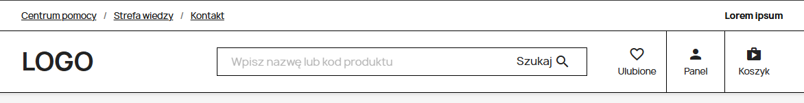
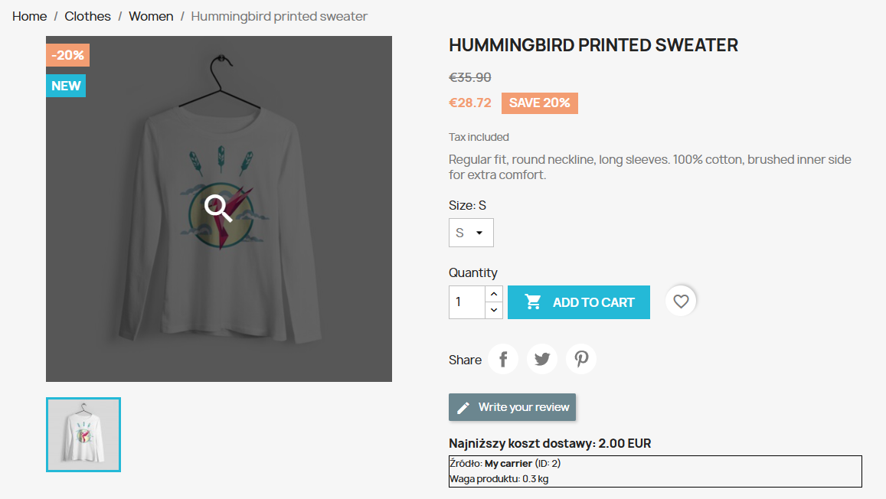

# PrestaShop Project

## 📌 Scope

The project consists of two main parts:

### 1. Header (theme customization)
- Implementation of a header layout based on the provided UI design:
  https://xd.adobe.com/view/87274cd6-ec0f-4b99-8bde-1ba62337cc17-d274/
- Built on top of the `classic` PrestaShop theme
- Focus on layout structure, positioning, and approximate styling rather than pixel-perfect reproduction



### 2. Shipping module

- Custom module `minshipping`
- Displays the lowest available **paid** shipping cost on the product page
- Uses hook: `displayProductAdditionalInfo`
- Takes into account PrestaShop shipping configuration (active carriers, zones, weight limits, and customer delivery address)
- Excludes free shipping methods (for example in-store pickup with `0.00` shipping cost)
- Shows a fallback message when no paid shipping method is available
- Uses escaped output in Smarty templates



---
## 🚀 Run

```bash
docker-compose up -d
```